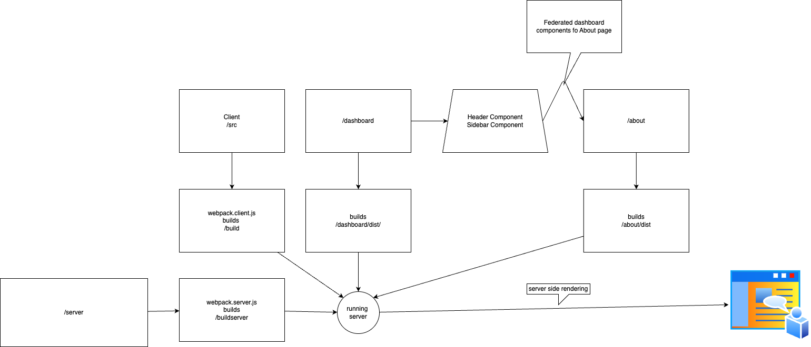

# Getting Started

### Run dashboard UI on http://localhost:3002/
- open terminal
- run cd dashboard
- yarn build
- yarn start

### Run about UI on http://localhost:3003/
- open second terminal
- run cd about
- yarn build
- yarn start

### Run node server for SSR on http://localhost:3001/
- open third terminal
- yarn start:server
navigate to pages
    - /
    - /about
    - /dashboard

## Details

Repo: 
https://github.com/chougulesurajb/node-react-ssr

Pull request for demo: 
https://github.com/chougulesurajb/node-react-ssr/pull/1

# Folder hierarchy

|                                       | Server            | build folder   |
| --------                              | --------          | -------        |
|server                                 | /server           | /buildserver   |
|client                                 | /src              | /build         |
|frontend -dashboard                    | /dashboard        | dashboard/dist |          
| - micro frontend -dashboard/Header    | /dashboard/Header | dashboard/dist |     
| - micro frontend -dashboard/Sidebar   | /dashboard/Header | dashboard/dist |   
|frontend -about                        | /about            | about/dist     |    

# Flow
